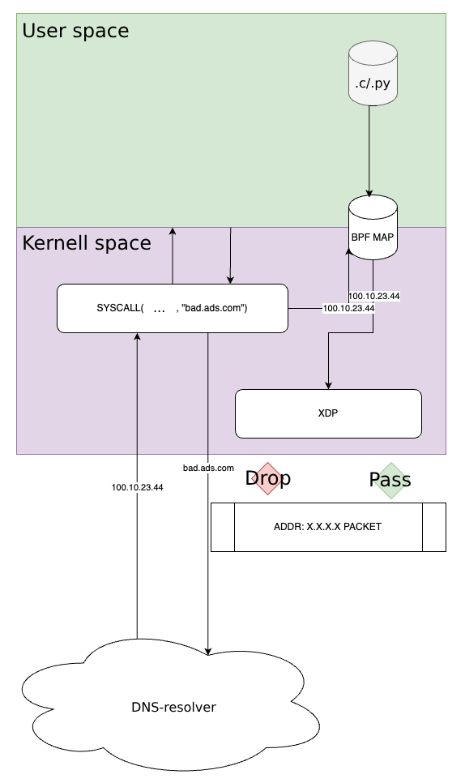

# eBPFAdblock

### Overview

This project is about traffic filtering at the kernel level using **BPF** and **XDP**. By blocking unwanted traffic before it reaches user space we enhance performance and make experience of using websites free from distractions.

### eBPF introduction

eBPF stands for extended Backerly Packet Filter, however, nowadays because of the significant development of its functionality this name is more symbolic. Using eBPF one can safely and with minimal overhead change the behaviour of Linux kernel at the runtime. To find out for more about Linux, its kernel, networking and packet filtering our team selected **Analysis/modification of network packets using eBPF** as topic of our project and decided to do Adblock based on this technology.

### Compilation and attachment of XDP program
`make`

### Usage
Adding ip addresses which should be blocked: 
`sudo bin/manage add <ip-address> 1`

Deleting ip addresses which should be blocked: 
`sudo bin/manage delete <ip-address>`

Adding/deleting ip addresses from file. ip addresses should be separated by '\n': 
`sudo python3 map_ip_adder.py <file_path> <add | delete>`

Showing ip addresses from the map: 
`sudo bin/manage show`

Testing: 
`ping <blocked-ip-address>`

### Detachment of XDP program 
`make clean`

### General workflow

### Implementation Details

- **Blocked IP addresses** are added to a BPF map using a python or C script .
- **Blocked domains** are stored in a _separate_ BPF map.
- When a DNS query is made the resolved IP address is added to the IP address map to others.
- **Filtering Mechanism**: the XDP program checks incoming packets against the blocked IP map:
    - If the IP address is in the map the packet is dropped.
    - Else the packet is allowed to pass through.

### References
AdGuard adblocker: https://github.com/AdguardTeam/HostlistsRegistry
- we used this repository for collecting a list of malicious domain names

 
